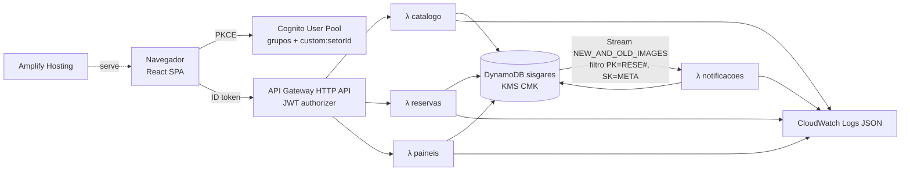
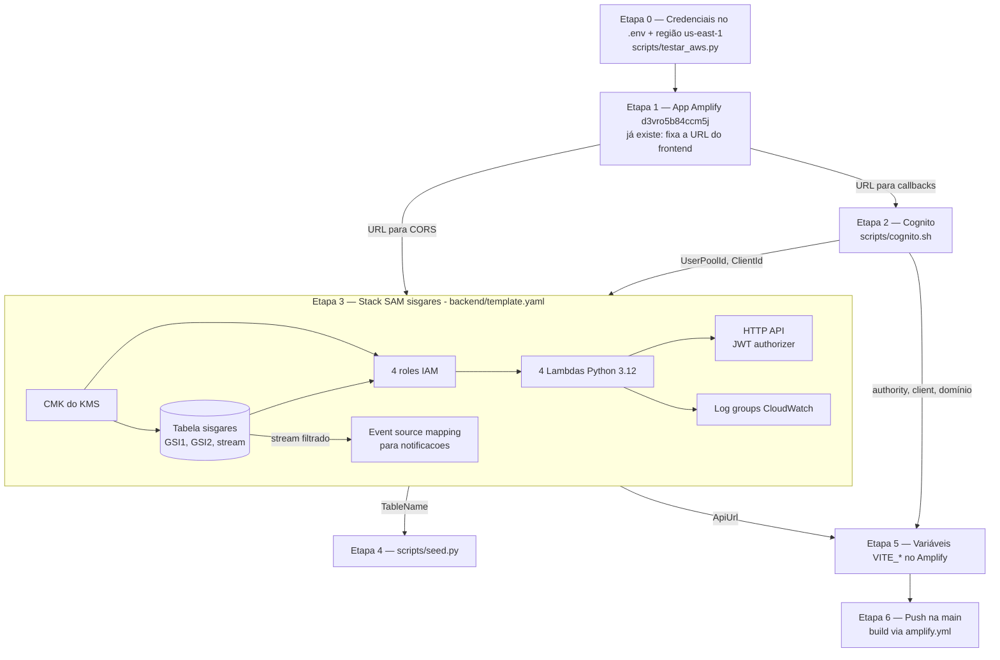

# Design — SISGARES MVP

Complementa o `ARQUITETURA.md`. Onde este documento diverge dele, vale este (porta 5173,
DynamoDB Streams, AVP fora do MVP, Cognito provisionado por script e não pelo SAM).

## 1. Arquitetura



- **Orientado a evento:** e-mails e pedidos SNP saem do stream, não da requisição. A API responde rápido, e um erro na notificação não desfaz a reserva. Com isso o MVP pontua em "arquitetura orientada a eventos" sem precisar de EventBridge.
- **IaC:** um `template.yaml` SAM (tabela, CMK, HTTP API, 4 Lambdas, roles). O Cognito vem do script do `ARQUITETURA.md`, com callbacks `http://localhost:5173/` e a URL do Amplify, e entra no SAM só como parâmetros (`UserPoolId`, `ClientId`). Ordem e detalhes de provisionamento em §12.

## 2. Estrutura do repositório

```
backend/
  template.yaml
  samconfig.toml                # stack sisgares, us-east-1 (sem segredo)
  src/                          # CodeUri das 4 Lambdas
    requirements.txt            # versões fixas: aws-lambda-powertools, pydantic v2 (empacotado pelo sam build)
    dominio/                    # Python puro, sem boto3
      modelos.py                # Reserva, Periodo, ItemRecurso, Config, Ambiente, Recurso
      regras.py                 # validar_basico (RN1-4, RN9), status (RN13), pode_alterar/cancelar (RN12)
      conflitos.py              # conflitos_ambiente (RN5/6), excesso_recurso (RN8)
      hierarquia.py             # ancestrais/descendentes/raiz
      notificacao.py            # setores_envolvidos, diff_reservas, montar_email
    comum/
      auth.py                   # Usuario.from_claims, autorizar(), log de decisão
      repo.py                   # acesso ao DynamoDB (único lugar com boto3)
      http.py                   # erros -> respostas (400/403/404/409)
    handlers/
      catalogo.py  reservas.py  paineis.py  notificacoes.py
  tests/                        # pytest: test_regras.py, test_conflitos.py, test_auth.py, test_notificacao.py
frontend/                       # Vite + React + TS + Tailwind + shadcn/ui
scripts/
  cognito.sh                    # passos do ARQUITETURA.md, com callback 5173
  seed.py                       # CSV -> DynamoDB (R11)
  smoke_amplify.py              # já existe: conferência do deploy no Amplify
amplify.yml                     # já existe: build de frontend/ -> frontend/dist
```

O frontend já tem um esqueleto (React 19, Vite 8, TypeScript 6, oxlint). O deploy é **por push
na `main`**: o app Amplify `d3vro5b84ccm5j` está conectado ao GitHub com auto-build e segue o
`amplify.yml`. Não há script de deploy manual (o plano B do `ARQUITETURA.md` só vale se a
conexão com o GitHub falhar).

**Versões fixas:** todas as dependências (npm e pip) usam versão exata, sem `^` ou `~`.
O `package.json` do esqueleto veio com `^`/`~` e deve ser fixado nas versões do
`package-lock.json` (e `npm config set save-exact true` em `frontend/.npmrc`).

Todas as Lambdas usam `CodeUri: src/` (relativo a `backend/template.yaml`), cada uma com o seu
`Handler` e a sua role. O `requirements.txt` fica dentro de `backend/src/` porque o `sam build` só
instala as dependências do `requirements.txt` que estiver no `CodeUri`.

## 3. Modelo de dados (tabela única `sisgares`)

| Item | PK | SK | GSI1PK / GSI1SK | GSI2PK / GSI2SK | Atributos |
|---|---|---|---|---|---|
| Ambiente | `CAT#AMBI` | `<id>` | | | desc, ativo, paiId, setores[] |
| Disposição | `CAT#DISP` | `<id>` | | | desc, ativo, icone |
| Recurso | `CAT#RECU` | `<id>` | | | desc, grupoId, limitado, disponibilidade, ativo, icone, ambientesVinculados[], setores[] |
| Setor | `CAT#ENVO` | `<id>` | | | desc, email, ativo |
| Vínculo setor | `CAT#VINC` | `AMBI#<id>#ENVO#<id>` ou `RECU#<id>#ENVO#<id>` | | | codigoServicoSnp? |
| Config | `CAT#CONF` | `GLOBAL` | | | faixaInicio, faixaFim, antecedenciaMin, margemMin |
| Reserva | `RESE#<id>` | `META` | | `SOLI#<sub>` / `<criadoEm>` | finalidade, participantes, ambienteId?, complemento?, disposicaoId?, periodos[], recursos[{id,qtd}], solicitanteSub, solicitanteEmail, setoresIds[], cancelada, versao |
| Agenda do período | `RESE#<id>` | `PER#<n>` | | `AGENDA` / `<inicio>#<id>` | inicio, termino, cancelada |
| Ocupação de ambiente | `RESE#<id>` | `PER#<n>#AMBI#<a>` | `AMBI#<a>` / `<inicio>#<id>` | | inicio, termino |
| Ocupação de recurso limitado | `RESE#<id>` | `PER#<n>#RECU#<r>` | `RECU#<r>` / `<inicio>#<id>` | | inicio, termino, qtd |
| Lock | `LOCK#AMBI#<raiz>` / `LOCK#RECU#<r>` | `LOCK` | | | versao |
| E-mail simulado | `RESE#<id>` | `EMAIL#<ts>#<setor>` | | `NOTIF` / `<ts>` | setorId, para, assunto, tipo(criada/alterada/cancelada), alteracoes[{campo,antes,depois}], html |
| Pedido SNP | `RESE#<id>` | `SNP#<setor>` | | | numero, codigoServico, situacao |

IDs novos: `RESE#` usa contador atômico (`CTR#RESE`), começando acima do maior ID do seed. O número SNP usa o `CTR#SNP`.

### Algoritmo de conflito (RN5–RN7)

1. `afetados = {a} ∪ ancestrais(a) ∪ descendentes(a)`. A hierarquia vem do catálogo, carregado uma vez por invocação.
2. Para cada `x ∈ afetados` e cada período novo: Query no GSI1 com `GSI1PK = AMBI#x` e `GSI1SK < (término + margem)`. Depois, filtra em código `termino + margem > inicio` e descarta a própria reserva. No MVP isso lê todo o histórico do ambiente, o que é aceitável com o volume do seed. Próximo passo: particionar por mês.
3. Recurso limitado: Query `GSI1PK = RECU#r`, `GSI1SK < término`, filtro `termino > inicio`, agrupando por reserva. Soma + qtd ≤ disponibilidade.
4. **Gravação atômica (RN7):** `TransactWriteItems` com:
   - `Update LOCK#AMBI#<raiz(a)>` (pai e filhos compartilham o lock) e `LOCK#RECU#r` de cada recurso limitado: `SET versao = versao + 1` com a condição `versao = :lida` (ou `attribute_not_exists`);
   - Put do META e dos itens `PER#…`; na alteração, Delete dos itens antigos.

   Se der `TransactionCanceled` por condição, relê, revalida uma vez e retorna 409 se continuar em conflito. Isso serializa as gravações de uma mesma árvore de ambientes sem bloquear as leituras.

## 4. API (HTTP API, todas com JWT)

| Método e rota | Lambda | Papel | Descrição |
|---|---|---|---|
| GET `/catalogo` | catalogo | todos | Ambientes, disposições, grupos, recursos (com vínculos e limitado), config. Sem e-mail de setor. |
| GET `/ambientes/{id}/ocupacao?de&ate` | paineis | todos | Períodos ocupados do ambiente + ancestrais + descendentes (sem dados da reserva). |
| POST `/reservas/validar` | reservas | solicitante, admin | Dry-run de R2–R4. Retorna `{ok, erros[{campo, periodoIndex?, codigo, mensagem, sugestao?}]}`. |
| POST `/reservas` | reservas | solicitante, admin | Cria. 201 ou 400/409 com `erros[]`. |
| GET `/reservas?minhas=1` | reservas | solicitante, admin | Reservas do usuário (GSI2 `SOLI#sub`), com status. |
| GET `/reservas/{id}` | reservas | dono, admin, atendente do setor | Detalhe (mascarado para o atendente). |
| PUT `/reservas/{id}` | reservas | dono, admin | Altera (R5.1). |
| DELETE `/reservas/{id}` | reservas | dono, admin | Cancela (R5.2). |
| GET `/painel/atendimento?de&ate` | paineis | atendente, admin | Cards (R8) com pedidos SNP. |
| GET `/notificacoes?de&ate` | paineis | atendente, admin | E-mails e pedidos SNP (atendente: só o seu setor). |

Corpo da reserva:
`{finalidade, participantes, ambienteId|null, complemento?, disposicaoId?, periodos:[{inicio, termino}], recursos:[{recursoId, qtd}]}`.
Validação com Pydantic: tamanhos máximos, inteiros positivos, ISO com offset, no máximo 10 períodos e 20 recursos.

Códigos de erro do domínio: `PERIODO_INVALIDO`, `CAMPO_OBRIGATORIO`, `FORA_FAIXA`, `SEM_ANTECEDENCIA`, `RECURSO_INDISPONIVEL_AMBIENTE`, `CONFLITO_AMBIENTE`, `RECURSO_ESGOTADO`, `RESERVA_ENCERRADA`, `CANCELAMENTO_SEM_ANTECEDENCIA`.

## 5. Autorização

- `Usuario(sub, email, grupos, setorId)` montado das claims, com `cognito:groups` "[a b]" convertido em lista.
- `autorizar(usuario, acao, reserva)`, com `acao ∈ {criar, ler, alterar, cancelar, listar_atendimento, listar_notificacoes}`. Versão em código. A assinatura já fica pronta para trocar por `IsAuthorizedWithToken` (AVP) depois.
- Mascaramento centralizado em `comum/auth.py::mascarar_para(usuario, reserva)`.
- Log: `Logger` do Powertools com `{usuario: sub, grupo, acao, reservaId, decisao}`.

## 6. Notificações (Lambda `notificacoes`)

- Gatilho: stream da tabela, com filtro `PK prefix "RESE#"` e `SK = "META"`. Batch 10, `bisect on error`, `MaximumRetryAttempts: 2`, sem DLQ no MVP: um registro que falha 3 vezes (1 tentativa + 2 retentativas) é descartado e o erro fica no log da função, sem travar o shard.
- `INSERT` → tipo `criada`; `MODIFY` com `cancelada` passando a true → `cancelada`; outro `MODIFY` → `alterada`, com `diff_reservas(old, new)` sobre os campos período, ambiente, disposição, finalidade, participantes e recursos.
- Setores: união de `setores` do ambiente e dos recursos pedidos (na alteração, setores antigos ∪ novos, para avisar quem saiu também).
- Para cada setor: grava `EMAIL#…`. Se algum vínculo desse setor com o ambiente ou com um recurso pedido tiver `codigoServicoSnp`, faz o upsert de `SNP#<setor>` (cria com um número novo, mantém o número na alteração, `situacao=cancelado` no cancelamento).
- O HTML do e-mail é gerado com escape (`html.escape`) e é semântico. O frontend **não** renderiza esse HTML: mostra os campos estruturados (`alteracoes[]`), evitando XSS.

## 7. Frontend

Bibliotecas: react-router, @tanstack/react-query, react-oidc-context (oidc-client-ts), react-hook-form + zod, shadcn/ui (Radix), lucide-react, date-fns + date-fns-tz. Em dev: **oxlint** (já configurado em `frontend/.oxlintrc.json`) com o plugin `jsx-a11y` habilitado, e @axe-core/react.

| Rota | Papel | Conteúdo |
|---|---|---|
| `/` | todos | Redireciona: solicitante → `/grade`; atendente/admin → `/atendimento`. |
| `/grade` | solicitante, admin | Combobox de ambiente, navegação por semana, tabela de 30 min (R7). |
| `/reservas/nova`, `/reservas/:id/editar` | solicitante, admin | Formulário (R2): ambiente (com a opção "Não solicitado / local próprio"), disposição em radio-cards com imagem e `alt`, finalidade, participantes, lista dinâmica de períodos (`datetime-local`), recursos agrupados por grupo e filtrados pelo ambiente (RN9), com quantidade só para os limitados. Validação no servidor com debounce de 500 ms ao mudar um período, resultado em `aria-live="polite"`. No submit com erro: resumo com `role="alert"` e links para os campos. |
| `/minhas-reservas` | solicitante, admin | Lista com status em texto + badge, Editar e Cancelar (AlertDialog de confirmação). |
| `/atendimento` | atendente, admin | Cards por data (R8), com `<h2>` por dia e lista semântica. |
| `/notificacoes` | atendente, admin | Caixa de saída: destinatário, assunto, tipo, alterações (`ALTERADO: campo — antes → depois`, com `<del>`/`<ins>`) e pedidos SNP. |

Layout: skip link, `<header>`/`<nav aria-label="Principal">`/`<main>`, `document.title` por rota, foco no `<h1>` ao trocar de rota, tema com contraste ≥ 4.5:1 conferido, alvos ≥ 24px (44px no mobile), reflow em 320px (no mobile a grade vira a lista de horários de um dia).

Config via `VITE_COGNITO_AUTHORITY`, `VITE_COGNITO_CLIENT_ID`, `VITE_COGNITO_DOMAIN`, `VITE_API_URL` e `VITE_REDIRECT_URI`. O logout usa o endpoint `/logout` do domínio Cognito.

## 8. Segurança

- CMK do KMS na tabela, HTTPS em todo lugar (Amplify, API GW, Cognito).
- Roles mínimas: catalogo → `DynamoDBReadPolicy`; paineis → `DynamoDBReadPolicy`; reservas → `DynamoDBCrudPolicy`; notificacoes → leitura do stream + `DynamoDBCrudPolicy`. Todas com `kms:Decrypt` (e `GenerateDataKey` nas que escrevem, a confirmar: ver §12.5) na CMK.
- CORS restrito à URL do Amplify e a `http://localhost:5173`. Throttling no stage (ex.: 50 rps, burst 100).
- Nenhum e-mail ou dado pessoal nos logs (só `sub`). Os dados do seed são fictícios (`example.com`, setores do CSV).
- Como cada item acima é provisionado (recursos, policies, parâmetros) está em §12.

## 9. Testes

- `backend/tests` com pytest, só sobre o domínio e o `auth` (sem AWS). Cada exemplo da seção 6 do caso vira um caso nomeado (`test_rn5_margem_1120_bloqueado`, `test_rn5_margem_1130_aceito`, `test_rn6_pai_filho`, `test_rn7_segundo_salvamento`, `test_rn8_projetor_2_bloqueado_1_aceito` etc.). A RN7 é testada no domínio, revalidando contra o estado atualizado; o lock transacional é verificado na demo.
- Frontend: `npm run build` + `npm run lint` (oxlint com `jsx-a11y`). Checklist manual de teclado e axe nas 5 telas.

## 10. Decisões e premissas

| Decisão | Motivo |
|---|---|
| Uma unidade (PR/CE) | Não há dados de unidade macro. RN3/RN9 ficam só com a faixa global e os vínculos de ambiente. |
| Reservas sintéticas geradas pelo seed | Falta o CSV da reserva. |
| `codigoServicoSnp` acrescentado no seed | Os CSVs não têm o campo. Sem ele a RN11 não aparece na demo. |
| RN8 soma as reservas sobrepostas (literal da regra) | É mais simples e conservador que o pico simultâneo. Fica registrado como possível refinamento. |
| Atendente vê e-mail mascarado | O caso pede "solicitante" no card, e o ARQUITETURA.md proíbe dados pessoais para o atendente (LGPD). |
| AVP fora do MVP | 2h de prazo. A assinatura de `autorizar` já está pronta para a troca. |
| Cognito por `scripts/cognito.sh`, fora do SAM | O `ARQUITETURA.md` lista o Cognito no SAM, mas também traz o passo a passo em CLI, já testado. O script é idempotente e o stack recebe só `UserPoolId` e `ClientId`. Com isso um `sam delete` não apaga as contas de demo. |
| Primeiro `sam deploy` logo após o `template.yaml`, com handlers stub | Assim a tabela existe cedo e a Trilha D pode rodar o seed sem esperar a API. Consequência: as reservas do seed não geram e-mails nem pedidos SNP, porque o stub da `notificacoes` consome e descarta esses eventos do stream (§12.5). |

## 11. Roteiro da demo (para o pitch)

1. Solicitante: na grade do Auditório (Completo), aciona "Reservar às 09:00" → formulário preenchido → adiciona café e 1 projetor → salva.
2. Tenta Parte A em horário sobreposto → bloqueio RN6. Tenta 11:20 após uma reserva até 11:00 → bloqueio RN5.
3. Pede 2 projetores portáteis com 2 já reservados no horário → bloqueio RN8.
4. Altera o horário → e-mail "ALTERADO" na tela de Notificações (como admin).
5. Atendente (SMSG): cards dos próximos dias com o e-mail mascarado. Admin: pedido SNP gerado para SEART.
6. Cancela com confirmação.

## 12. Infraestrutura e provisionamento

Região: `us-east-1` (a do hackathon, em `AWS_DEFAULT_REGION` no `.env`). Só entram os serviços
do `ARQUITETURA.md`. Cada parte tem uma ferramenta dona:

| Parte | Ferramenta | Quando roda |
|---|---|---|
| App Amplify `d3vro5b84ccm5j` + branch `main` | AWS CLI (passo 0 do `ARQUITETURA.md`) | **Já feito.** Não recriar. |
| Cognito: User Pool, domínio, app client, grupos, contas de demo | `scripts/cognito.sh` (passos 1–7 do `ARQUITETURA.md`) | Fase 0, uma vez (idempotente). |
| CMK, tabela `sisgares`, 4 Lambdas + roles, HTTP API, event source do stream, log groups | AWS SAM: `backend/template.yaml` → `sam build && sam deploy` (stack `sisgares`) | Trilha B: primeiro deploy logo após o template (handlers stub) e redeploy com os handlers reais. |
| Dados de catálogo, config, contadores e reservas sintéticas | `scripts/seed.py` | Trilha D, depois do primeiro deploy. |
| Build e publicação do frontend | Amplify, por push na `main` (`amplify.yml`) | Fase 3, depois de cadastrar as variáveis `VITE_*`. |

### 12.1 Ordem de dependência



Dentro do stack o CloudFormation resolve a ordem sozinho pelas referências (`!Ref`/`!GetAtt`).
A ordem entre as Etapas 0–6 é responsabilidade de quem executa e está nas tarefas.

### 12.2 Serviço a serviço

**Amplify Hosting**
- Propósito: hospedar a SPA com HTTPS em `https://main.d3vro5b84ccm5j.amplifyapp.com/`.
- Recursos: app `d3vro5b84ccm5j` conectado ao GitHub, branch `main` com auto-build. Já existem.
- Configuração: build pelo `amplify.yml` (publica só `frontend/dist`); variáveis `VITE_*` na branch
  (`aws amplify update-branch --environment-variables`), porque o Vite embute os valores
  no build e o Amplify não lê o `.env` local; regra de rewrite de SPA (caminhos sem extensão de
  arquivo → `/index.html`, status 200), para que rotas como `/grade` funcionem ao recarregar a página:

  ```bash
  aws amplify update-app --app-id "$AMPLIFY_APP_ID" --custom-rules \
    '[{"source":"</^[^.]+$/>","target":"/index.html","status":"200"}]'
  ```

- Contingência (`ARQUITETURA.md`): sem conexão com o GitHub, deploy manual no mesmo app
  (`create-deployment` + `start-deployment`); com `AccessDenied` no Amplify, S3 + CloudFront.
  Nos dois casos a URL muda e é preciso atualizar callbacks do Cognito e CORS (ver pendências).
- Saídas: `AMPLIFY_APP_ID` e a URL da branch.

**Cognito User Pool** (`scripts/cognito.sh`)
- Propósito: login (Authorization Code + PKCE) e papéis.
- Recursos: User Pool `sisgares` (login por e-mail, `AllowAdminCreateUserOnly`, política de senha,
  atributo `setorId` no schema → `custom:setorId`); domínio da página de login; app client público
  `sisgares-web` (sem secret, fluxo `code`, escopos `openid email profile`, `read-attributes` com
  `custom:setorId`, `write-attributes` só `email`); grupos `solicitante`, `atendente`, `admin`;
  3 contas de demo por `admin-create-user --message-action SUPPRESS` com senha permanente.
- Configuração: callbacks e logout URLs `http://localhost:5173/` e `https://main.d3vro5b84ccm5j.amplifyapp.com/`
  (com a barra final, iguais ao `VITE_REDIRECT_URI`). Idempotência: antes de cada `create-*`, o script
  consulta (`list-user-pools`, `describe-user-pool-domain`, `list-user-pool-clients`, `get-group`,
  `admin-get-user`) e reaproveita o que existe. Mudança de callback usa `update-user-pool-client`
  com **todos** os flags (ele zera o que não for informado).
- Permissões: só as credenciais de quem roda o script. Sem triggers Lambda.
- Variáveis de entrada: o script do `ARQUITETURA.md` usa `$APP_ID` e `$AWS_REGION`; o `cognito.sh`
  faz a ponte com o `.env` logo no início: `APP_ID=${AMPLIFY_APP_ID:?}` e
  `export AWS_REGION=${AWS_DEFAULT_REGION:-us-east-1}`. O prefixo do domínio vem de
  `DOMINIO=${COGNITO_DOMAIN:-}`; se vazio (primeira execução), o script pede o sufixo (`read -p`),
  monta `sisgares-<sufixo>` e grava `COGNITO_DOMAIN` no `.env`, para que a próxima execução
  reaproveite o mesmo prefixo.
- Saídas (gravadas no `.env`): `COGNITO_USER_POOL_ID`, `COGNITO_CLIENT_ID`, `COGNITO_DOMAIN` (só o
  prefixo, ver §12.3).
  Issuer: `https://cognito-idp.us-east-1.amazonaws.com/<UserPoolId>`. A senha de demo é lida sem
  eco e não vai para o `.env` nem para o repositório.

**KMS (CMK)** — no `template.yaml`
- Propósito: criptografia em repouso da tabela e do stream.
- Recursos: `AWS::KMS::Key` (key policy com a conta como administradora, para que as policies IAM
  valham) e `AWS::KMS::Alias` `alias/sisgares`. Rotação automática habilitada.
- Permissões: concedidas nas roles das Lambdas (abaixo), não na key policy.

**DynamoDB** — no `template.yaml`
- Propósito: tabela única com catálogo, reservas, ocupações, locks e notificações (§3).
- Recursos: tabela `sisgares` com `PK`/`SK` (string), `GSI1` (`GSI1PK`/`GSI1SK`) e `GSI2`
  (`GSI2PK`/`GSI2SK`), ambos com projeção `ALL` (modelo em §3).
- Configuração: `PAY_PER_REQUEST`; `SSESpecification` com `SSEType: KMS` e a CMK acima;
  `StreamSpecification: NEW_AND_OLD_IMAGES`.
- Saídas: `TableName` (vai para `TABLE_NAME` das Lambdas e do seed) e o ARN do stream (usado
  internamente pelo event source).

**Lambda + IAM** — no `template.yaml`
- Recursos: 4 `AWS::Serverless::Function` com `Runtime: python3.12`, `CodeUri: src/` (relativo a
  `backend/template.yaml`; dependências em `backend/src/requirements.txt`) e `Handler` próprio
  (`handlers/catalogo.handler` etc.). Cada função tem a **sua** role, gerada pelo SAM a partir do
  bloco `Policies` (uma role por Lambda).
- Variáveis de ambiente (`Globals`): `TABLE_NAME` (`!Ref` da tabela), `POWERTOOLS_SERVICE_NAME`,
  `LOG_LEVEL`. Nenhum segredo.
- Permissões (privilégio mínimo: policy templates do SAM com `TableName` da tabela e, quando não
  houver template, statement inline restrito ao ARN da CMK):

| Lambda | Policies | KMS na CMK |
|---|---|---|
| catalogo | `DynamoDBReadPolicy` | `KMSDecryptPolicy` |
| paineis | `DynamoDBReadPolicy` | `KMSDecryptPolicy` |
| reservas | `DynamoDBCrudPolicy` (cobre as ações do `TransactWriteItems`) | `KMSDecryptPolicy` + statement inline `kms:GenerateDataKey` |
| notificacoes | `DynamoDBCrudPolicy` + leitura do stream (o SAM acrescenta ao declarar o evento `DynamoDB`) | `KMSDecryptPolicy` + statement inline `kms:GenerateDataKey` |

  Todas recebem só escrita de logs (`AWSLambdaBasicExecutionRole`, incluída pelo SAM).
- Event source do stream (função `notificacoes`), sem DLQ; com `MaximumRetryAttempts: 2`, um
  registro com erro é descartado depois de 3 falhas e não trava o shard (§6):

  ```yaml
  Events:
    Stream:
      Type: DynamoDB
      Properties:
        Stream: !GetAtt Tabela.StreamArn
        StartingPosition: LATEST
        BatchSize: 10
        BisectBatchOnFunctionError: true
        MaximumRetryAttempts: 2          # depois disso o registro é descartado (sem DLQ no MVP)
        FilterCriteria:
          Filters:
            - Pattern: '{"dynamodb": {"Keys": {"PK": {"S": [{"prefix": "RESE#"}]}, "SK": {"S": ["META"]}}}}'
  ```

**API Gateway HTTP API** — no `template.yaml`
- Recursos: `AWS::Serverless::HttpApi` e as rotas da §4, declaradas como eventos `HttpApi` de cada
  função.
- Configuração: authorizer JWT `CognitoJwt` como `DefaultAuthorizer`, com
  `IdentitySource: $request.header.Authorization`, `issuer` montado com `!Sub` a partir do parâmetro
  `UserPoolId` e `audience: [!Ref ClientId]` (o ID token traz o client ID em `aud`);
  `CorsConfiguration` com `AllowOrigins` = parâmetro `AmplifyOrigin` e `http://localhost:5173`
  (origem **sem** barra final, diferente das callbacks), `AllowHeaders` `authorization` e
  `content-type`, métodos `GET POST PUT DELETE OPTIONS`; `DefaultRouteSettings` com
  `ThrottlingRateLimit: 50` e `ThrottlingBurstLimit: 100`. O preflight `OPTIONS` é respondido pelo
  próprio HTTP API, sem passar pelo authorizer.
- Saída: `ApiUrl` (`https://<api-id>.execute-api.us-east-1.amazonaws.com`).

**CloudWatch Logs** — no `template.yaml`
- Um `AWS::Logs::LogGroup` explícito por função, com `LogGroupName: !Sub /aws/lambda/${CatalogoFunction}`
  (o `!Ref` da função devolve o nome gerado pelo CloudFormation, já que não há `FunctionName` fixo)
  e `RetentionInDays: 7`, para o grupo de logs não ficar sem prazo. As decisões `allow`/`deny` de §5 caem nesses grupos em JSON.

**Verified Permissions (AVP)** — fora do MVP
- Não é provisionado na demo. No próximo passo entra no mesmo `template.yaml`: policy store, identity
  source apontando para o User Pool, schema e as políticas da §5; as roles da `reservas` **e** da
  `paineis` (que chama `autorizar` em `listar_atendimento` e `listar_notificacoes`) ganham
  `verifiedpermissions:IsAuthorizedWithToken` no ARN do policy store. Nenhuma ação da §5 roda na
  `catalogo` ou na `notificacoes`, e nenhuma das duas recebe a permissão.

**Secrets Manager** — não provisionado
- O MVP não tem integração externa (e-mail e SNP são simulados). Só entra junto com SES ou o SNP real.

### 12.3 Parâmetros, outputs e variáveis

| Nome | Origem | Consumidor |
|---|---|---|
| `AMPLIFY_APP_ID` | `aws amplify list-apps` (tarefa 0.2) | `scripts/cognito.sh` (`APP_ID`), `aws amplify update-app`/`update-branch` |
| `UserPoolId`, `ClientId` (parâmetros SAM) | `.env` (`COGNITO_USER_POOL_ID`, `COGNITO_CLIENT_ID`), via `--parameter-overrides` | JWT authorizer |
| `AmplifyOrigin` (parâmetro SAM, padrão `https://main.d3vro5b84ccm5j.amplifyapp.com`) | URL do app Amplify | CORS |
| `ApiUrl` (output) | stack `sisgares` | `.env` (`API_URL`), `VITE_API_URL` |
| `TableName` (output) | stack `sisgares` | `.env` (`TABLE_NAME`), `scripts/seed.py` |
| `VITE_COGNITO_AUTHORITY` | issuer do pool | frontend |
| `VITE_COGNITO_CLIENT_ID` | `COGNITO_CLIENT_ID` | frontend |
| `COGNITO_DOMAIN` | `scripts/cognito.sh`: só o prefixo (`sisgares-<sufixo>`), não a URL | `.env`, montagem do `VITE_COGNITO_DOMAIN` |
| `VITE_COGNITO_DOMAIN` | `https://${COGNITO_DOMAIN}.auth.us-east-1.amazoncognito.com` | frontend (login e `/logout`) |
| `VITE_REDIRECT_URI` | `http://localhost:5173/` em dev; URL do Amplify na branch `main` | frontend |

`sam build` e `sam deploy` rodam em `backend/`; o `samconfig.toml` fica em `backend/samconfig.toml`.
Esse arquivo (stack `sisgares`, região `us-east-1`, `CAPABILITY_IAM`, `resolve_s3 = true`)
pode ser versionado porque não guarda segredo; os IDs do Cognito entram por `--parameter-overrides`
lidos do `.env`. Os **nomes** das variáveis novas entram no `.env-example`; os valores ficam só no
`.env`, que está no `.gitignore`.

### 12.4 Conferência e remoção

- Conferência: `sam validate --lint`; `aws cloudformation describe-stacks --stack-name sisgares`
  com status `*_COMPLETE`; `curl` sem token em `ApiUrl/catalogo` → 401; login de demo redireciona
  com `?code=`; `aws dynamodb describe-table` mostra `SSEType KMS`, os 2 GSIs e o stream.
- Remoção depois do hackathon: `sam delete --stack-name sisgares` (apaga a tabela; a CMK fica por
  `DeletionPolicy: Retain`), depois `aws kms schedule-key-deletion --key-id <id> --pending-window-in-days 7`,
  `delete-user-pool-domain` e `delete-user-pool`.

### 12.5 Decisões de provisionamento

Decididas (aplicar no `template.yaml`):

- Retenção dos log groups: 7 dias (`RetentionInDays: 7`).
- `DeletionPolicy`/`UpdateReplacePolicy`: `Delete` na tabela e `Retain` na CMK (exclusão agendada à
  mão, §12.4).
- As reservas do seed não geram e-mails nem pedidos SNP: o seed roda depois da B.2, quando a
  `notificacoes` implantada ainda é o stub, que descarta os eventos do stream (`LATEST`). A tela
  Notificações ganha dados na demo (passo 4 da §11).

Pendentes:

| Pendência | Opção sugerida até decidir |
|---|---|
| `kms:GenerateDataKey` nas roles que escrevem (`reservas`, `notificacoes`) é de fato necessário? Para acesso via DynamoDB a documentação costuma citar só `kms:Decrypt` e `kms:DescribeKey`. | Manter o statement inline até a primeira escrita da B.7; se a escrita funcionar sem ele, remover (privilégio mínimo). |
| Plano B do frontend (S3 + CloudFront) não está detalhado no `ARQUITETURA.md` | Se acionado, decidir na hora se entra no SAM ou é feito por CLI, e atualizar callbacks e CORS. |
| Sufixo único do domínio de login do Cognito (`DOMINIO`) | Pedido pelo `cognito.sh` na primeira execução (`read -p`) e gravado em `COGNITO_DOMAIN` no `.env`; as execuções seguintes reaproveitam esse valor. |
