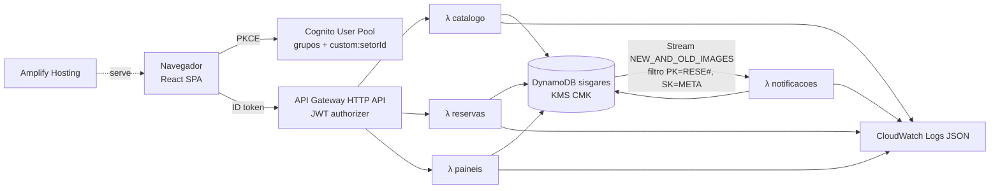

# Design — SISGARES MVP

Complementa o `ARQUITETURA.md`. Onde este documento diverge dele, vale este (porta 5173,
DynamoDB Streams, AVP fora do MVP).

## 1. Arquitetura



- **Orientado a evento:** e-mails e pedidos SNP saem do stream, não da requisição. A API responde rápido, e um erro na notificação não desfaz a reserva. Com isso o MVP pontua em "arquitetura orientada a eventos" sem precisar de EventBridge.
- **IaC:** um `template.yaml` SAM (tabela, CMK, HTTP API, 4 Lambdas, roles). O Cognito vem do script do `ARQUITETURA.md`, com callbacks `http://localhost:5173/` e a URL do Amplify, e entra no SAM só como parâmetros (`UserPoolId`, `ClientId`).

## 2. Estrutura do repositório

```
backend/
  template.yaml
  requirements.txt              # versões fixas: aws-lambda-powertools, pydantic v2
  src/
    dominio/                    # Python puro, sem boto3
      modelos.py                # Reserva, Periodo, ItemRecurso, Config, Ambiente, Recurso
      regras.py                 # validar_basico (RN1-4, RN9), status (RN13), pode_alterar/cancelar (RN12)
      conflitos.py              # conflitos_ambiente (RN5/6), excesso_recurso (RN8)
      hierarquia.py             # ancestrais/descendentes/raiz
      notificacao.py            # setores_envolvidos, diff_reservas, montar_email
    comum/
      auth.py                   # Usuario.from_claims, autorizar(), log de decisão
      repo.py                   # acesso ao DynamoDB (único lugar com boto3)
      http.py                   # erros -> respostas (400/403/404/409)
    handlers/
      catalogo.py  reservas.py  paineis.py  notificacoes.py
  tests/                        # pytest: test_regras.py, test_conflitos.py, test_auth.py, test_notificacao.py
frontend/                       # Vite + React + TS + Tailwind + shadcn/ui
scripts/
  cognito.sh                    # passos do ARQUITETURA.md, com callback 5173
  seed.py                       # CSV -> DynamoDB (R11)
  deploy-frontend.sh            # build + amplify create-deployment + upload zip
```

Todas as Lambdas usam `CodeUri: backend/src`, cada uma com o seu `Handler` e a sua role.

## 3. Modelo de dados (tabela única `sisgares`)

| Item | PK | SK | GSI1PK / GSI1SK | GSI2PK / GSI2SK | Atributos |
|---|---|---|---|---|---|
| Ambiente | `CAT#AMBI` | `<id>` | | | desc, ativo, paiId, setores[] |
| Disposição | `CAT#DISP` | `<id>` | | | desc, ativo, icone |
| Recurso | `CAT#RECU` | `<id>` | | | desc, grupoId, limitado, disponibilidade, ativo, icone, ambientesVinculados[], setores[] |
| Setor | `CAT#ENVO` | `<id>` | | | desc, email, ativo |
| Vínculo setor | `CAT#VINC` | `AMBI#<id>#ENVO#<id>` ou `RECU#<id>#ENVO#<id>` | | | codigoServicoSnp? |
| Config | `CAT#CONF` | `GLOBAL` | | | faixaInicio, faixaFim, antecedenciaMin, margemMin |
| Reserva | `RESE#<id>` | `META` | | `SOLI#<sub>` / `<criadoEm>` | finalidade, participantes, ambienteId?, complemento?, disposicaoId?, periodos[], recursos[{id,qtd}], solicitanteSub, solicitanteEmail, setoresIds[], cancelada, versao |
| Agenda do período | `RESE#<id>` | `PER#<n>` | | `AGENDA` / `<inicio>#<id>` | inicio, termino, cancelada |
| Ocupação de ambiente | `RESE#<id>` | `PER#<n>#AMBI#<a>` | `AMBI#<a>` / `<inicio>#<id>` | | inicio, termino |
| Ocupação de recurso limitado | `RESE#<id>` | `PER#<n>#RECU#<r>` | `RECU#<r>` / `<inicio>#<id>` | | inicio, termino, qtd |
| Lock | `LOCK#AMBI#<raiz>` / `LOCK#RECU#<r>` | `LOCK` | | | versao |
| E-mail simulado | `RESE#<id>` | `EMAIL#<ts>#<setor>` | | `NOTIF` / `<ts>` | setorId, para, assunto, tipo(criada/alterada/cancelada), alteracoes[{campo,antes,depois}], html |
| Pedido SNP | `RESE#<id>` | `SNP#<setor>` | | | numero, codigoServico, situacao |

IDs novos: `RESE#` usa contador atômico (`CTR#RESE`), começando acima do maior ID do seed. O número SNP usa o `CTR#SNP`.

### Algoritmo de conflito (RN5–RN7)

1. `afetados = {a} ∪ ancestrais(a) ∪ descendentes(a)`. A hierarquia vem do catálogo, carregado uma vez por invocação.
2. Para cada `x ∈ afetados` e cada período novo: Query no GSI1 com `GSI1PK = AMBI#x` e `GSI1SK < (término + margem)`. Depois, filtra em código `termino + margem > inicio` e descarta a própria reserva. No MVP isso lê todo o histórico do ambiente, o que é aceitável com o volume do seed. Próximo passo: particionar por mês.
3. Recurso limitado: Query `GSI1PK = RECU#r`, `GSI1SK < término`, filtro `termino > inicio`, agrupando por reserva. Soma + qtd ≤ disponibilidade.
4. **Gravação atômica (RN7):** `TransactWriteItems` com:
   - `Update LOCK#AMBI#<raiz(a)>` (pai e filhos compartilham o lock) e `LOCK#RECU#r` de cada recurso limitado: `SET versao = versao + 1` com a condição `versao = :lida` (ou `attribute_not_exists`);
   - Put do META e dos itens `PER#…`; na alteração, Delete dos itens antigos.

   Se der `TransactionCanceled` por condição, relê, revalida uma vez e retorna 409 se continuar em conflito. Isso serializa as gravações de uma mesma árvore de ambientes sem bloquear as leituras.

## 4. API (HTTP API, todas com JWT)

| Método e rota | Lambda | Papel | Descrição |
|---|---|---|---|
| GET `/catalogo` | catalogo | todos | Ambientes, disposições, grupos, recursos (com vínculos e limitado), config. Sem e-mail de setor. |
| GET `/ambientes/{id}/ocupacao?de&ate` | paineis | todos | Períodos ocupados do ambiente + ancestrais + descendentes (sem dados da reserva). |
| POST `/reservas/validar` | reservas | solicitante, admin | Dry-run de R2–R4. Retorna `{ok, erros[{campo, periodoIndex?, codigo, mensagem, sugestao?}]}`. |
| POST `/reservas` | reservas | solicitante, admin | Cria. 201 ou 400/409 com `erros[]`. |
| GET `/reservas?minhas=1` | reservas | solicitante, admin | Reservas do usuário (GSI2 `SOLI#sub`), com status. |
| GET `/reservas/{id}` | reservas | dono, admin, atendente do setor | Detalhe (mascarado para o atendente). |
| PUT `/reservas/{id}` | reservas | dono, admin | Altera (R5.1). |
| DELETE `/reservas/{id}` | reservas | dono, admin | Cancela (R5.2). |
| GET `/painel/atendimento?de&ate` | paineis | atendente, admin | Cards (R8) com pedidos SNP. |
| GET `/notificacoes?de&ate` | paineis | atendente, admin | E-mails e pedidos SNP (atendente: só o seu setor). |

Corpo da reserva:
`{finalidade, participantes, ambienteId|null, complemento?, disposicaoId?, periodos:[{inicio, termino}], recursos:[{recursoId, qtd}]}`.
Validação com Pydantic: tamanhos máximos, inteiros positivos, ISO com offset, no máximo 10 períodos e 20 recursos.

Códigos de erro do domínio: `PERIODO_INVALIDO`, `CAMPO_OBRIGATORIO`, `FORA_FAIXA`, `SEM_ANTECEDENCIA`, `RECURSO_INDISPONIVEL_AMBIENTE`, `CONFLITO_AMBIENTE`, `RECURSO_ESGOTADO`, `RESERVA_ENCERRADA`, `CANCELAMENTO_SEM_ANTECEDENCIA`.

## 5. Autorização

- `Usuario(sub, email, grupos, setorId)` montado das claims, com `cognito:groups` "[a b]" convertido em lista.
- `autorizar(usuario, acao, reserva)`, com `acao ∈ {criar, ler, alterar, cancelar, listar_atendimento, listar_notificacoes}`. Versão em código. A assinatura já fica pronta para trocar por `IsAuthorizedWithToken` (AVP) depois.
- Mascaramento centralizado em `comum/auth.py::mascarar_para(usuario, reserva)`.
- Log: `Logger` do Powertools com `{usuario: sub, grupo, acao, reservaId, decisao}`.

## 6. Notificações (Lambda `notificacoes`)

- Gatilho: stream da tabela, com filtro `PK prefix "RESE#"` e `SK = "META"`. Batch 10, `bisect on error`, sem DLQ no MVP.
- `INSERT` → tipo `criada`; `MODIFY` com `cancelada` passando a true → `cancelada`; outro `MODIFY` → `alterada`, com `diff_reservas(old, new)` sobre os campos período, ambiente, disposição, finalidade, participantes e recursos.
- Setores: união de `setores` do ambiente e dos recursos pedidos (na alteração, setores antigos ∪ novos, para avisar quem saiu também).
- Para cada setor: grava `EMAIL#…`. Se algum vínculo desse setor com o ambiente ou com um recurso pedido tiver `codigoServicoSnp`, faz o upsert de `SNP#<setor>` (cria com um número novo, mantém o número na alteração, `situacao=cancelado` no cancelamento).
- O HTML do e-mail é gerado com escape (`html.escape`) e é semântico. O frontend **não** renderiza esse HTML: mostra os campos estruturados (`alteracoes[]`), evitando XSS.

## 7. Frontend

Bibliotecas: react-router, @tanstack/react-query, react-oidc-context (oidc-client-ts), react-hook-form + zod, shadcn/ui (Radix), lucide-react, date-fns + date-fns-tz. Em dev: eslint-plugin-jsx-a11y e @axe-core/react.

| Rota | Papel | Conteúdo |
|---|---|---|
| `/` | todos | Redireciona: solicitante → `/grade`; atendente/admin → `/atendimento`. |
| `/grade` | solicitante, admin | Combobox de ambiente, navegação por semana, tabela de 30 min (R7). |
| `/reservas/nova`, `/reservas/:id/editar` | solicitante, admin | Formulário (R2): ambiente (com a opção "Não solicitado / local próprio"), disposição em radio-cards com imagem e `alt`, finalidade, participantes, lista dinâmica de períodos (`datetime-local`), recursos agrupados por grupo e filtrados pelo ambiente (RN9), com quantidade só para os limitados. Validação no servidor com debounce de 500 ms ao mudar um período, resultado em `aria-live="polite"`. No submit com erro: resumo com `role="alert"` e links para os campos. |
| `/minhas-reservas` | solicitante, admin | Lista com status em texto + badge, Editar e Cancelar (AlertDialog de confirmação). |
| `/atendimento` | atendente, admin | Cards por data (R8), com `<h2>` por dia e lista semântica. |
| `/notificacoes` | atendente, admin | Caixa de saída: destinatário, assunto, tipo, alterações (`ALTERADO: campo — antes → depois`, com `<del>`/`<ins>`) e pedidos SNP. |

Layout: skip link, `<header>`/`<nav aria-label="Principal">`/`<main>`, `document.title` por rota, foco no `<h1>` ao trocar de rota, tema com contraste ≥ 4.5:1 conferido, alvos ≥ 24px (44px no mobile), reflow em 320px (no mobile a grade vira a lista de horários de um dia).

Config via `VITE_COGNITO_AUTHORITY`, `VITE_COGNITO_CLIENT_ID`, `VITE_COGNITO_DOMAIN`, `VITE_API_URL` e `VITE_REDIRECT_URI`. O logout usa o endpoint `/logout` do domínio Cognito.

## 8. Segurança

- CMK do KMS na tabela, HTTPS em todo lugar (Amplify, API GW, Cognito).
- Roles mínimas: catalogo → `DynamoDBReadPolicy`; paineis → `DynamoDBReadPolicy`; reservas → `DynamoDBCrudPolicy`; notificacoes → leitura do stream + `DynamoDBCrudPolicy`. Todas com `kms:Decrypt` (e `GenerateDataKey` nas que escrevem) na CMK.
- CORS restrito à URL do Amplify e a `http://localhost:5173`. Throttling no stage (ex.: 50 rps, burst 100).
- Nenhum e-mail ou dado pessoal nos logs (só `sub`). Os dados do seed são fictícios (`example.com`, setores do CSV).

## 9. Testes

- `backend/tests` com pytest, só sobre o domínio e o `auth` (sem AWS). Cada exemplo da seção 6 do caso vira um caso nomeado (`test_rn5_margem_1120_bloqueado`, `test_rn5_margem_1130_aceito`, `test_rn6_pai_filho`, `test_rn7_segundo_salvamento`, `test_rn8_projetor_2_bloqueado_1_aceito` etc.). A RN7 é testada no domínio, revalidando contra o estado atualizado; o lock transacional é verificado na demo.
- Frontend: `npm run build` + lint jsx-a11y. Checklist manual de teclado e axe nas 5 telas.

## 10. Decisões e premissas

| Decisão | Motivo |
|---|---|
| Uma unidade (PR/CE) | Não há dados de unidade macro. RN3/RN9 ficam só com a faixa global e os vínculos de ambiente. |
| Reservas sintéticas geradas pelo seed | Falta o CSV da reserva. |
| `codigoServicoSnp` acrescentado no seed | Os CSVs não têm o campo. Sem ele a RN11 não aparece na demo. |
| RN8 soma as reservas sobrepostas (literal da regra) | É mais simples e conservador que o pico simultâneo. Fica registrado como possível refinamento. |
| Atendente vê e-mail mascarado | O caso pede "solicitante" no card, e o ARQUITETURA.md proíbe dados pessoais para o atendente (LGPD). |
| AVP fora do MVP | 2h de prazo. A assinatura de `autorizar` já está pronta para a troca. |

## 11. Roteiro da demo (para o pitch)

1. Solicitante: na grade do Auditório (Completo), aciona "Reservar às 09:00" → formulário preenchido → adiciona café e 1 projetor → salva.
2. Tenta Parte A em horário sobreposto → bloqueio RN6. Tenta 11:20 após uma reserva até 11:00 → bloqueio RN5.
3. Pede 2 projetores portáteis com 2 já reservados no horário → bloqueio RN8.
4. Altera o horário → e-mail "ALTERADO" na tela de Notificações (como admin).
5. Atendente (SMSG): cards dos próximos dias com o e-mail mascarado. Admin: pedido SNP gerado para SEART.
6. Cancela com confirmação.
